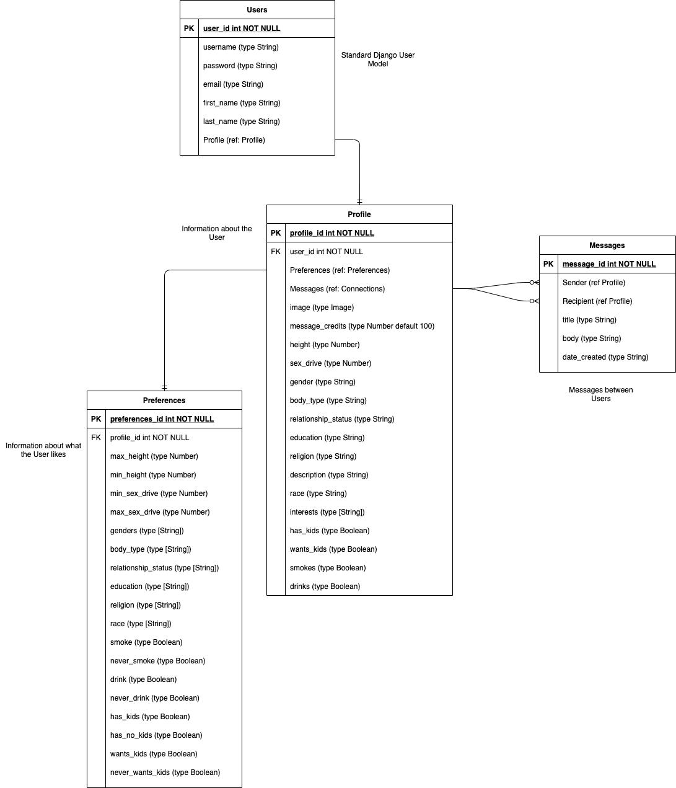

# BetterMeet
The future of online dating

# User Story

A user visits the home page and is invited to sign up for an account. They are then guided through a three page sign up process. The first page contains information to build their user account, the second page builds out their profile by allowing them to describe themselves, and the third page asks them to describe what they want in a partner. After signing up and logging in, they will go to their profile page where they will have the option to see potential matches or edit their profile or preferences. If they choose to see their matches, they will see all the users in the database of the gender(s) they like who also like the gender of the user. Clicking on the profile of another user will show additional details about the other user as well as their preferences. There will also be an option to send the other user a message. Each day every user will receive a number of credits that they can spend to send other users messages. The cost to send a message will vary based on how likely the other user is to respond. Replying to a message will always be free. Each user will have a page where they can read all of the messages they have sent or received.

# MVP

A user will be able to sign up for the site with an option to add a new gender to the database. A user will be able to edit their profile and preferences. A user will be able to view the profiles of other users with matching gender preferences. Messages and the message credit system will not be available.

# Schedule

Phase 1
 Monday-Project approval, Django set-up, Build models
 Tuesday-Sign-up Forms/Image upload
 Wednesday-Profile page and user index

Phase 2
 Thursday-Messages
 Friday-Functional MVP
 Weekend-Base styling
 Monday-Deployment

Phase 3
 Tuesday- Stretch goal: Message credits
 Wednesday-Final styling
 Thursday-Build database 

# ERD

# Wireframes
Home Page
 
Profile Sign Up
 
Preferences Sign Up
 
Profile Page
 
Send Message
 
All Messages

